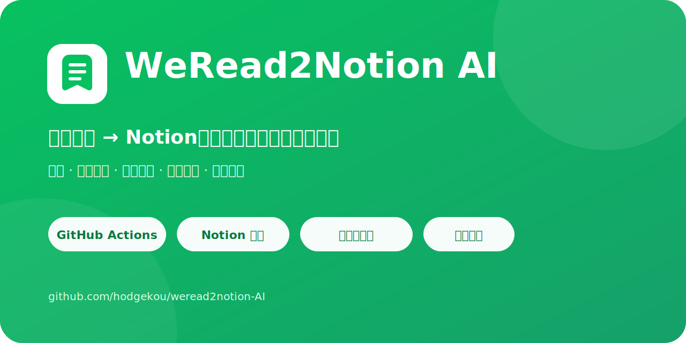
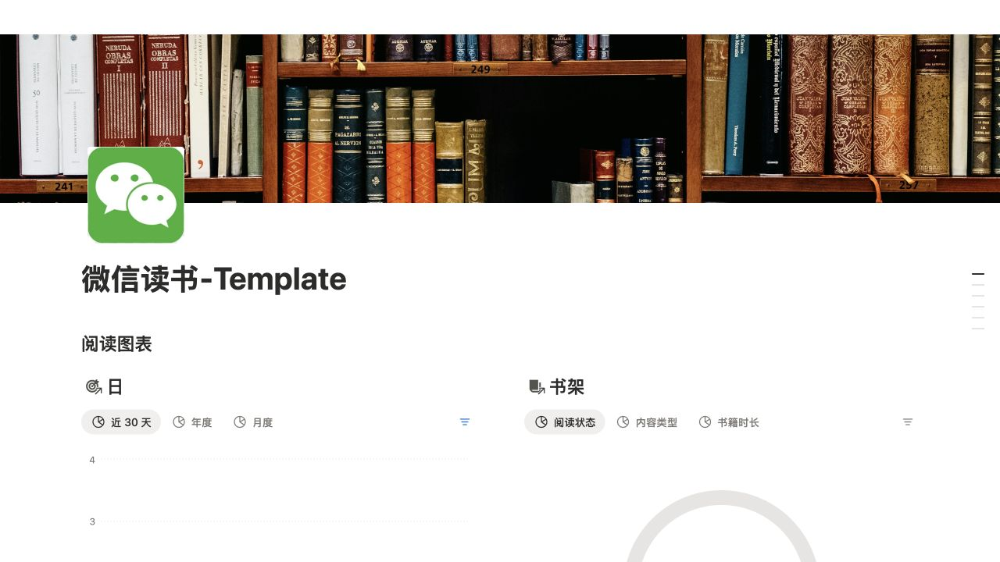

  

  

  
  
  
  

  <a href="https://app.notion.com/p/wph/Template-3a329affe5af800b8581f98b71e948fb">复制 Notion 模板</a> ·
  <a href="#开始使用">开始使用</a> ·
  <a href="https://github.com/hodgekou/weread2notion-AI/issues/new/choose">反馈问题</a>

# WeRead2Notion AI

> **永久免费、完整开源。** 将你的微信读书书架、阅读进度、章节、划线、个人想法和阅读统计，自动同步到一套完整的 Notion 阅读管理模板。

无需在电脑上长期运行程序。完成一次配置后，GitHub Actions 会每天自动同步。

  

同步后的 Notion 首页：原生阅读图表、书架状态、统计、分类、作者与设置。

## 为什么使用它

- **无需服务器**：只需 Notion、GitHub Actions 和微信读书 API Key。
- **一次配置，自动运行**：每天定时同步，也支持随时手动触发。
- **Notion 原生体验**：使用数据库、视图、分组、公式和 Chart，不依赖外部 Embed 服务。
- **划线直接进入书籍正文**：按章节整理划线和个人想法，不把内容做成大量 Tag。
- **书架口径清晰**：以微信读书当前书架为权威来源，人工“读完”标记决定已读状态。
- **安全重建**：全量同步前导出 JSON 备份，再归档旧记录。

如果这个项目帮你省下了配置和维护时间，欢迎点击右上角 **Star**。这会帮助更多有相同需求的人发现它。

## 开始使用

### 第一步：复制 Notion 模板

打开下面的模板页面，然后点击右上角的 `Duplicate`，将它复制到你自己的 Notion Workspace：

[复制 WeRead2Notion AI Template](https://app.notion.com/p/wph/Template-3a329affe5af800b8581f98b71e948fb)

复制完成后，请保存新页面的完整 URL。后面配置 `NOTION_PAGE` 时会用到它。

> 请使用 Duplicate 后的新页面，不要填写上面的公共模板地址。每次 Duplicate 都会生成一个新的页面 ID。

### 第二步：创建并连接 Notion Integration

1. 打开 [Notion Integrations](https://www.notion.so/profile/integrations)。
2. 点击 `New integration`。
3. 名称填写 `WeRead2Notion-AI`。
4. Workspace 选择刚才复制模板所在的 Workspace。
5. 在 Capabilities 中启用：
   - `Read content`
   - `Insert content`
   - `Update content`
6. 保存并复制生成的 Internal Integration Secret，后面将它配置为 `NOTION_TOKEN`。
7. 返回 Duplicate 后的 Notion 页面，点击右上角 `••• → Connections`，添加 `WeRead2Notion-AI`。

Integration 必须连接到最外层的“微信读书”模板页面，这样才能访问页面内的书架和统计数据库，以及各书籍页面中的章节化划线与笔记。

### 第三步：Fork 项目并配置 Secrets

点击 GitHub 页面右上角的 `Fork`，将本项目 Fork 到你自己的 GitHub 账号。

进入你 Fork 后的仓库，然后打开：

`Settings → Secrets and variables → Actions → New repository secret`

依次创建以下三个 Repository secrets：

| Secret 名称 | 填写内容 |
| --- | --- |
| `WEREAD_API_KEY` | 你的微信读书 Gateway API Key，可前往 [微信读书助手](https://weread.qq.com/r/weread-skills) 获取 |
| `NOTION_TOKEN` | 第二步创建的 `WeRead2Notion-AI` Integration Secret |
| `NOTION_PAGE` | 第一步 Duplicate 后的新 Notion 页面完整 URL |

Secret 名称必须完全一致，并注意以下对应关系：

- `NOTION_TOKEN` 所属的 Integration 必须是你在页面 Connections 中添加的同一个 Integration。
- `NOTION_PAGE` 必须是你自己的 Duplicate 页面，不能使用公共 Template 页面。
- 不要把任何 Token 或 API Key 写进 README、代码或 `.env` 后提交到 GitHub。

### 第四步：测试同步

1. 打开你 Fork 仓库的 `Actions` 页面。
2. 在左侧选择 `weread sync`。
3. 点击 `Run workflow`。
4. 首次测试保持 `full` 未勾选。
5. 再次点击绿色的 `Run workflow` 开始同步。

等待 `Sync` 任务显示绿色勾号后，刷新 Duplicate 后的 Notion 页面。你的书架、阅读进度、阅读时长和统计数据将出现在模板中；划线和笔记会按章节直接写入对应书籍的正文，不需要单独的章节数据库。

微信读书当前书架是同步范围的唯一依据。书籍从微信读书书架移除后，下一次成功同步会将它在 Notion 中的书籍页面、划线和笔记移入回收站。

“已读”状态以微信读书书架中的人工“读完”标记为准，不根据阅读进度是否达到 100% 推断。未标记读完但已有阅读记录的书会显示为“在读”。

工作流还会每天自动运行一次。只有需要备份并重新生成全部数据库记录时，才使用 `full` 模式。

## 注意：同步内容可能覆盖 Notion 中的手动修改

WeRead2Notion 会把微信读书作为同步数据的来源。下列内容由同步器管理，如果你直接在 Notion 中修改，后续普通同步或全量同步可能使用微信读书返回的数据重新更新或覆盖：

- 书架数据库中的书名、作者、分类、阅读状态、阅读进度、阅读时间等同步属性
- 日、周、月、年等阅读统计数据
- 书籍页面中标记为“由 WeRead2Notion 自动同步”的划线和笔记区域
- `同步配置版本（不可删除）` 系统字段

你自行添加在自动同步区域之外的普通页面内容，普通增量同步会尽量保留；模板主页的布局、分栏、数据库视图、筛选、排序和图表也不会被同步器重写。但 `full` 全量同步会备份并归档旧数据库记录，再重新创建记录，因此不要把需要长期保留的私人内容只存放在这些自动管理的数据库记录中。

“设置”数据库中的用户配置会被同步器读取，不会被系统默认值反复覆盖；只有系统维护的 `同步配置版本（不可删除）` 会在成功同步后自动更新。

## 个性化同步设置

最新模板包含一个“设置”数据库，其中的“同步设置”页面用于调整同步行为。每次同步都会先读取这些属性：

| 设置 | 类型 | 默认值 | 说明 |
| --- | --- | --- | --- |
| `阅读完成进度强制改为100%` | Checkbox | 关闭 | 已人工标记读完的书在 Notion 中显示为 100%，不修改微信读书真实进度 |
| `只同步我的书架书籍` | Checkbox | 开启 | 仅保留微信读书当前书架中的书籍；其他书籍及自动同步内容移入 Notion 回收站 |
| `同步划线和笔记` | Checkbox | 开启 | 将划线和个人想法按章节写入书籍正文 |
| `阅读统计起始年份` | Number | 2023 | 从该年份开始生成阅读统计 |

配置值遵循统一规则：开关只使用 Checkbox 的 `true / false`；数值只使用 Number 的实数，例如 `-1`、`0`、`1`、`2` 或 `0.5`。不要使用 `"true"`、`"false"`、`""` 或其他字符串模拟开关和数值。`同步配置版本（不可删除）` 是同步器维护的数字，用于识别设置变化，请勿删除或手动修改。

旧模板中没有“设置”数据库也无需手动升级：下一次联网同步会使用系统默认值，并自动创建数据库、默认配置页面和说明。修改设置后，下一次普通同步会自动刷新受影响的书籍，不需要运行全量同步。

## 常见问题

### 提示 `Could not find block with ID`

请检查：

- `NOTION_PAGE` 是否为 Duplicate 后的新页面 URL。
- 页面右上角 `••• → Connections` 中是否已经添加 `WeRead2Notion-AI`。
- GitHub 的 `NOTION_TOKEN` 是否属于该 Integration。
- Integration 和 Notion 页面是否位于同一个 Workspace。

### 日志显示了其他 Integration 名称

日志中的名称由 `NOTION_TOKEN` 决定，与 GitHub 仓库名称无关。请将 `NOTION_TOKEN` 替换为你自己创建的 `WeRead2Notion-AI` Integration Secret。

### “全部”视图没有数据

确认你使用的是最新 Template，并检查 Actions 是否已成功完成。不要在“全部”视图中添加空的年份筛选。

### “阅读时长格式化”显示“还未阅读”

请确认仓库已经同步到最新版本，然后重新运行一次 Actions。同步器会使用微信读书返回的累计阅读时长更新该字段。

## 问题反馈与功能建议

请通过 [GitHub Issues](https://github.com/hodgekou/weread2notion-AI/issues/new/choose) 提交问题或需求。仓库提供了面向维护者和 AI 的 Issue 模板，建议尽可能提供：

- 当前结果与期望结果
- 可以复现问题的操作步骤
- 脱敏后的 GitHub Actions 运行链接或日志
- 相关 Notion 页面、书名和 BookId
- 使用普通同步还是全量同步
- 可以判断问题已经解决的验收标准

除问题或需求描述外，其余信息可以留空或填写“不清楚”。请勿提交 `WEREAD_API_KEY`、`NOTION_TOKEN`、Cookie、`.env` 内容或其他敏感信息。

## 更多文档

- [技术文档与本地运行说明](docs/TECHNICAL.md)
- [v1.0.0 版本说明](docs/RELEASE_NOTES_v1.0.0.md)
- [社区发布文案](docs/COMMUNITY_POST.md)
- [GitHub 仓库发布设置](docs/GITHUB_PUBLISHING.md)
- [微信读书助手](https://weread.qq.com/r/weread-skills)
- [提交问题或功能建议](https://github.com/hodgekou/weread2notion-AI/issues/new/choose)

## AI 生成声明

本项目的代码、文档以及 Notion 模板适配工作完全由 OpenAI ChatGPT（Codex，GPT-5 系列模型）生成。

## License

MIT
