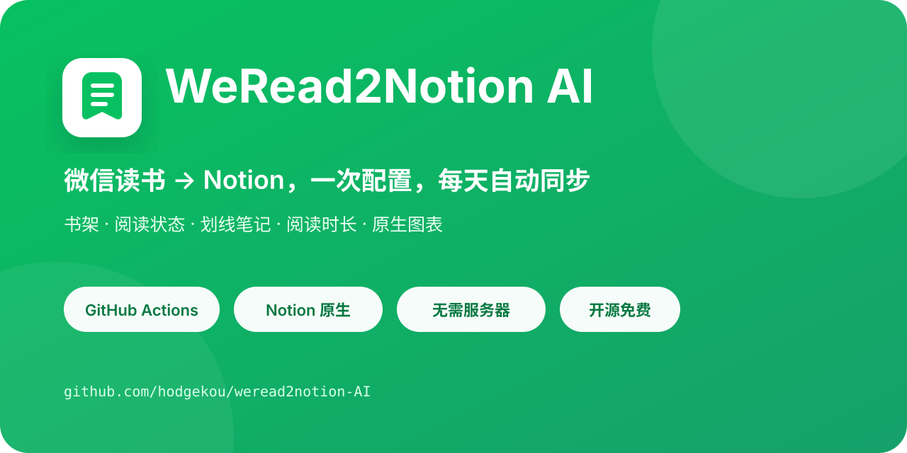
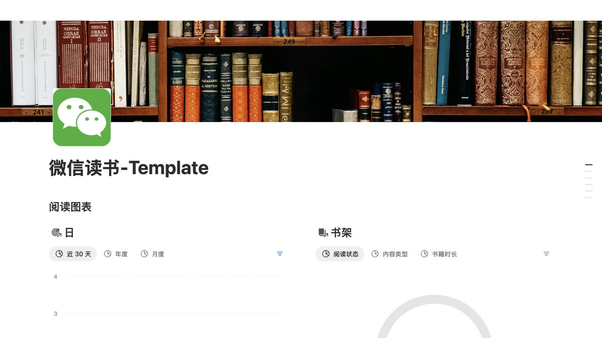

<p align="center">
  
</p>

<p align="center">
  
</p>

<p align="center">
  <a href="https://github.com/hodgekou/weread2notion-AI/actions/workflows/ci.yml"></a>
  <a href="https://github.com/hodgekou/weread2notion-AI/actions/workflows/weread.yml"></a>
  <a href="https://github.com/hodgekou/weread2notion-AI/tree/v1.0.0"></a>
  <a href="LICENSE"></a>
</p>

<p align="center">
  <a href="https://app.notion.com/p/wph/Template-3a329affe5af800b8581f98b71e948fb">复制 Notion 模板</a> ·
  <a href="#配置步骤">配置步骤</a> ·
  <a href="https://github.com/hodgekou/weread2notion-AI/issues/new/choose">提交问题</a>
</p>

# WeRead2Notion AI

一个免费开源的 **微信读书 → Notion 自动同步**工具。它会把你的书架、阅读状态、阅读时长、章节、划线、个人想法和阅读统计同步到 Notion 原生模板中，并由 GitHub Actions 每天自动运行。

<p align="center">
  <a href="https://app.notion.com/p/wph/Template-3a329affe5af800b8581f98b71e948fb">
    
  </a>
</p>

关键词：微信读书、Notion、自动同步、划线、笔记、阅读统计、GitHub Actions。

## 可以同步什么

- 以微信读书 `/shelf/sync` 为权威来源同步当前书架。
- 同步书籍、作者、分类、日/周/月/年阅读统计和原生 Notion Charts。
- 将划线和个人想法按章节写入书籍页面正文，不创建大量 Tag。
- 以微信读书人工“读完”标记判断“已读”，不会用 100% 阅读进度代替完成状态。
- 每天为每本书保存一条阅读快照，记录累计时长、当日新增时长、进度、状态和当前章节。
- 支持普通增量同步、全量重建、dry-run 预览、GitHub Actions Summary 和本地数据导出。

## 配置步骤

### 1. Duplicate Notion 模板

打开 [WeRead2Notion AI Template](https://app.notion.com/p/wph/Template-3a329affe5af800b8581f98b71e948fb)，点击右上角 **Duplicate**，把模板复制到自己的 Notion Workspace。

复制后使用新页面的完整 URL；不要把公共模板链接配置为 `NOTION_PAGE`。每次 Duplicate 都会生成新的页面 ID。

### 2. 创建 Notion Integration 并连接页面

1. 打开 [Notion Integrations](https://www.notion.so/profile/integrations)，点击 **New integration**。
2. 选择与 Duplicate 页面相同的 Workspace，名称可填写 `WeRead2Notion-AI`。
3. 在 Capabilities 中启用 `Read content`、`Insert content`、`Update content`。
4. 保存并复制 Internal Integration Secret；它就是 `NOTION_TOKEN`。
5. 回到 Duplicate 后的最外层页面，点击 `••• → Connections`，添加刚创建的 Integration。

必须连接最外层的“微信读书”页面，而不是只连接其中某个数据库。否则同步器无法递归发现书架、统计和设置页面。

### 3. Fork 项目

点击本仓库右上角 **Fork**，把项目 Fork 到你自己的 GitHub 账号。之后应在自己的 Fork 中配置 Secrets、运行 Actions 和查看同步结果；上游仓库只用于获取更新。

### 4. 添加三个 GitHub Secrets

进入你自己的 Fork：

`Settings → Secrets and variables → Actions → New repository secret`

创建以下三个 **Repository secrets**，名称必须完全一致：

| Secret | 内容 |
| --- | --- |
| `WEREAD_API_KEY` | 微信读书 Gateway API Key，可从 [微信读书助手](https://weread.qq.com/r/weread-skills) 获取 |
| `NOTION_TOKEN` | 第 2 步创建的 Notion Integration Secret |
| `NOTION_PAGE` | 第 1 步 Duplicate 后的新页面完整 URL，或页面名称加 32 位页面 ID，例如 `WeRead2Notion-AI-202609-33f29affe5af832584a3812322c93a25` |

对应关系必须正确：`NOTION_TOKEN` 所属 Integration 必须已经连接到 `NOTION_PAGE`；不要使用公共模板页面。不要把 Token、API Key、Cookie 或 `.env` 内容提交到 GitHub。

### 5. 手动测试一次

1. 打开 Fork 的 **Actions** 页面。
2. 选择左侧的 **weread sync** workflow。
3. 点击 **Run workflow**。
4. 第一次测试保持 `full` 不勾选，然后点击绿色的 **Run workflow**。
5. 等待 `Sync` job 通过，打开 job 的 **Summary** 查看同步数量，再刷新 Notion 页面。

普通同步不会重建整套数据库。只有需要备份并重建全部数据库记录时才勾选 `full`；全量同步会将 JSON 备份作为 Actions artifact 保存。

如果微信读书 Gateway 在读取某一本书的详情时临时返回 499 或其他可重试请求错误，普通同步会跳过这本书、保留它现有的 Notion 页面，并继续处理其他书籍；失败书籍会列在 Actions Summary 中，下一次同步会再次尝试。全量同步也会继续处理其他可用书籍：失败书籍的既有 Notion 数据会保留，不会因为导入书籍、下架书籍或临时接口错误而中断整个任务或生成不完整的破坏性重建。

### 6. 自动运行时间

workflow 默认每天 **北京时间 04:00** 自动运行（GitHub Actions 使用 UTC，因此配置是 `0 20 * * *`）。也可以随时手动运行。修改仓库中的 workflow 后，记得提交并推送到你自己的 Fork。

## 同步规则与覆盖范围

微信读书当前书架是同步范围的唯一依据。书籍从书架移除后，下一次成功同步会将对应的 Notion 书籍页面、自动同步的划线和笔记移入回收站；历史阅读快照会保留，便于查看趋势。

同步器会管理书架属性、统计数据库、书籍页面中的自动同步正文和系统配置字段。直接修改这些自动管理内容，后续同步可能重新写入微信读书返回的数据。主页布局、分栏、数据库视图、筛选、排序和图表不会被同步器重写；你在自动同步区域之外添加的普通页面内容会尽量保留。

“已读”以微信读书 `finishReading=1` 的人工状态为准。没有标记读完但有阅读记录的书仍显示为“在读”；“阅读完成进度强制改为100%”只改变 Notion 展示，不会修改微信读书真实进度。

## Notion 个性化设置

模板中的“设置”数据库包含一个“同步设置”页面。每次同步前都会读取这些配置；没有设置页面时，程序会按默认值自动创建。

| 设置名称 | 类型 | 默认值 | 作用 |
| --- | --- | --- | --- |
| `阅读完成进度强制改为100%` | Checkbox | `false` | 已标记读完的书在 Notion 显示为 100% |
| `只同步我的书架书籍` | Checkbox | `true` | 移出微信读书书架的书及其自动同步内容移入回收站 |
| `同步划线和笔记` | Checkbox | `true` | 将划线和个人想法按章节写入书籍正文 |
| `保存阅读快照` | Checkbox | `true` | 是否保存每日每本书的阅读快照 |
| `阅读统计起始年份` | Number | `2023` | 从哪一年开始生成阅读统计 |

配置格式只有两种：开关必须使用真正的 Checkbox（`true` / `false`），数字必须使用 Number，可以是整数或实数，例如 `-1`、`0`、`1`、`2`、`0.5`。不要使用 `"true"`、`"false"`、空字符串或其他字符串代替它们。

`同步配置版本（不可删除）` 是程序维护的系统字段，用于识别配置变化；请不要删除或手动修改。用户配置被读取后不会被默认值覆盖。

## 本地运行与高级命令

需要 Python 3.10+。本地运行时只使用 `.env.example` 作为配置模板：

```bash
cp .env.example .env
python -m venv .venv
source .venv/bin/activate
pip install -e .
```

`.env` 中配置：

```dotenv
WEREAD_API_KEY=你的微信读书APIKey
NOTION_TOKEN=你的NotionIntegrationSecret
NOTION_PAGE=https://app.notion.com/p/wph/WeRead2Notion-AI-202609-33f29affe5af832584a3812322c93a25#33f29affe5af832584a3812322c93a25
# 也可以只填写页面名称和页面 ID：
# NOTION_PAGE=WeRead2Notion-AI-202609-33f29affe5af832584a3812322c93a25
```

可选环境变量：`START_YEAR`（默认 `2023`）、`BACKUP_DIR`（默认 `backups`）、`NOTION_VERSION` 和 `NOTION_REQUEST_INTERVAL`。

```bash
# 检查模板数据库和属性
weread2notion check

# 只读取微信读书并显示计划，不连接或修改 Notion
weread2notion sync --dry-run

# 普通同步
weread2notion sync

# 备份并重建全部数据库行
weread2notion sync --full

# 导出当前书架，不连接或修改 Notion
weread2notion export --format json --output weread-export
weread2notion export --format markdown --output weread-export
```

`--dry-run` 适合在第一次配置或排查问题时使用。`export` 生成 `manifest.json`；Markdown 模式还会在 `books/` 下生成每本书的简介、划线和笔记。导出的内容可能包含个人阅读数据，请按私密数据保存。

## 常见问题

### `Could not find block with ID`

确认 `NOTION_PAGE` 是 Duplicate 后的新页面；Integration 已通过 `••• → Connections` 连接最外层页面；`NOTION_TOKEN` 与该 Integration 对应；页面和 Integration 在同一 Workspace。

### “全部”视图为空或年份显示为“无年”

先确认 Actions 成功完成，并使用最新 Template。年份来自同步器写入的完成日期/阅读日期属性；不要在“全部”视图中保留空的年份筛选。

### GitHub Actions 没有自动运行

检查你查看的是自己 Fork 的 Actions，而不是上游仓库；确认 workflow 文件存在于默认分支，并在仓库 Actions 设置中允许 workflow 运行。GitHub 的定时任务可能有少量延迟。

### “阅读时长格式化”显示“还未阅读”

确认同步已成功，并重新运行一次普通同步。该字段由微信读书返回的累计阅读时长更新。

### 如何同步上游更新

在自己的 Fork 页面点击 **Sync fork**，先将上游 `main` 合并到自己的 `main`，再运行 Actions。同步 Fork 不会自动修改你的 Notion 数据，但更新后的同步代码可能改变写入规则；升级前请查看 Release 说明。

## 问题反馈

请通过 [GitHub Issues](https://github.com/hodgekou/weread2notion-AI/issues/new/choose) 提交问题或功能建议。尽量提供：期望结果、复现步骤、脱敏后的 Actions 链接或日志、相关书名/BookId、是否使用 `full`，以及可验证的验收标准。绝不要提交任何 API Key、Token、Cookie、`.env` 内容或私人笔记原文。

更多技术细节见 [技术文档](docs/TECHNICAL.md)，版本信息见 [v1.0.0 Release Notes](docs/RELEASE_NOTES_v1.0.0.md)。

## AI 生成声明

本项目的代码、文档以及 Notion 模板适配工作完全由 OpenAI ChatGPT（Codex，GPT-5 系列模型）生成。

## 维护状态

当前版本以稳定同步为目标，后续更新优先处理微信读书接口兼容性、Notion 写入可靠性和用户反馈。若更新涉及数据结构或同步规则，会在 Release Notes 中单独说明。

## License

MIT
